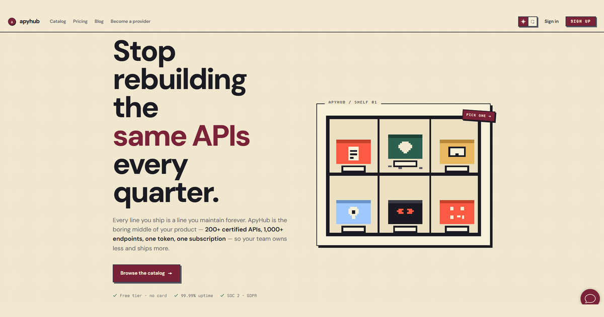

# Featured APIs

<a href="../README.md#featured-apis">Back to the main directory</a>

API Mega List keeps each featured API provider in a separate collection so their products, descriptions, and placement remain distinct.

| Featured API provider | Collection | Listings | Focus |
|-----------------------|------------|---------:|-------|
| ApyHub | [ApyHub Utility API Collection](./apyhub-utility-apis/) | **200 APIs** | AI, files, data extraction, validation, SEO, HR, marketing, and utilities |
| CoreClaw | [CoreClaw Web, Social & Commerce Scraper APIs](./coreclaw-scraper-apis/) | **118 APIs** | Social media, e-commerce, search, jobs, maps, leads, and real estate |

The collections are ordered alphabetically and follow the repository's [sponsored partner placement policy](../SPONSORED_PARTNERS.md).
