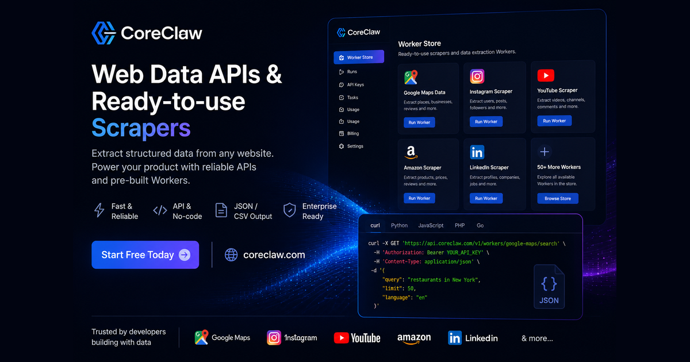

# CoreClaw Web, Social & Commerce Scraper APIs

<a href="../../README.md#featured-apis">Back to featured APIs</a>

> **Sponsored partner collection**

Explore **118 CoreClaw scraper APIs** for social media, e-commerce, search, jobs, maps, lead generation, real estate, SEO, and structured web data. CoreClaw calls these tools Workers; every listing below is API-addressable and links directly to the appropriate tool page.

  <a href="https://www.coreclaw.com/store/categories?fpr=chris69"><strong>Browse the CoreClaw scraper catalog</strong></a>

**Snapshot checked:** July 21, 2026  
**Public catalog endpoint:** `GET https://openapi.coreclaw.com/api/v2/store`  
**API base URL:** `https://openapi.coreclaw.com`

## Scraper Categories

| Category | APIs | Category | APIs |
|----------|-----:|----------|-----:|
| [Amazon](#amazon) Amazon products, pricing, and reviews | **15** | [eBay](#ebay) Listings, product data, and seller research | **3** |
| [Facebook](#facebook) Pages, posts, comments, groups, and ads | **13** | [Glassdoor](#glassdoor) Jobs and employer intelligence | **2** |
| [Google](#google) Search, trends, shopping, and news | **10** | [Google Maps](#google-maps) Places, reviews, and lead data | **3** |
| [Google Play Store](#google-play-store) Apps and reviews | **2** | [Indeed](#indeed) Job listings and company data | **5** |
| [Instagram](#instagram) Profiles, posts, reels, comments, and leads | **12** | [LinkedIn](#linkedin) Profiles, companies, jobs, and people data | **10** |
| [Other](#other) Research, finance, products, courses, and utilities | **18** | [SEO & Marketing](#seo-and-marketing) Email discovery and SEO audits | **2** |
| [TikTok](#tiktok) Profiles, videos, comments, and shops | **9** | [Walmart](#walmart) Products, categories, keywords, and SKUs | **4** |
| [YouTube](#youtube) Channels, videos, comments, search, and leads | **9** | [Zillow](#zillow) Property and market data | **1** |

---

## Scraper Catalog

### Amazon (15)

- [Amazon / eBay Product Scraper](https://www.coreclaw.com/xgbetu6d/amazon-product-scraper-keyword-v2?fpr=chris69) — `xgbetu6d/amazon-product-scraper-keyword-v2` — Amazon / eBay Product Scraper can collect product listings from Amazon or eBay by keyword and export the data in your preferred format. You can use this data for competitive analysis, price monitoring, or as a data foundation for new applications and automated workflows. _(by xgbetu6d)_
- [Amazon Price Scraper(by Keywords)](https://www.coreclaw.com/coreclaw/amazon-product-scraper?fpr=chris69) — `coreclaw/amazon-product-scraper` — Batch-scrape real-time Amazon product pricing data via keyword search and automatically compile comprehensive product pricing insights. Bypass API restrictions to retrieve accurate pricing data, helping sellers benchmark competitor prices and optimize product pricing strategies.
- [Amazon Product Listing Scraper(by Keywords&Domain )](https://www.coreclaw.com/coreclaw/amazon-product-scraper-api?fpr=chris69) — `coreclaw/amazon-product-scraper-api` — Fetch real-time Amazon search data via keyword search and domain filtering. Bypass API limitations to obtain accurate ranking and domain-based product data for keyword optimization and competitor tracking.
- [Amazon Product Scraper (by ASIN )](https://www.coreclaw.com/coreclaw/amazon-product-data-scraper-api?fpr=chris69) — `coreclaw/amazon-product-data-scraper-api` — Extract public Amazon product data by ASINs. Capture details such as product title, brand, price, reviews, seller information, ranking, images, category, product details, and more. Export the data, access it via API, or integrate it with third-party tools.
- [Amazon Product Scraper (Prices, Reviews & Listings)](https://www.coreclaw.com/coreclaw/amazon-global-product-scraper?fpr=chris69) — `coreclaw/amazon-global-product-scraper` — Extract public product data from Amazon global marketplaces by keywords. Capture details such as product title, brand, price, discount, currency, review count, ASIN, sales, ranking, and more. Export the data, access it via API, or integrate it with third-party tools.
- [Amazon Product Scraping (for Price Monitoring)](https://www.coreclaw.com/odin-kael/amazon-product-scraper?fpr=chris69) — `odin-kael/amazon-product-scraper` — Bulk scrape product details via Amazon product URL, including title, price, rating, review count, images, category and more. Supports Amazon domains across 10+ countries, with 2,000 free credits for new users. _(by Kael Odin)_
- [Amazon Reviews Scraper (for Product Insights)](https://www.coreclaw.com/coreclaw/amazon-reviews-scraper?fpr=chris69) — `coreclaw/amazon-reviews-scraper` — Extract public Amazon product review data by URL. Capture details such as review content, rating, review date, reviewer information, verified purchase status, and more. Export the data, access it via API, or integrate it with third-party tools.
- [Amazon Scraper API (by URL)](https://www.coreclaw.com/coreclaw/amazon-product-scraper-tool?fpr=chris69) — `coreclaw/amazon-product-scraper-tool` — Enter a URL to call the data scraping API and instantly extract full public product and store data. Bypass official API limits with accurate and stable results, enabling cross-border sellers and developers to automate data synchronization and streamline business workflows.
- [Amazon Scraper(by URL)](https://www.coreclaw.com/coreclaw/amazon-global-product-scraper-tool?fpr=chris69) — `coreclaw/amazon-global-product-scraper-tool` — Extract public product data from Amazon global marketplaces by URLs, including product title, brand, seller, price, discount, and more. Export the data, access it via API, or integrate it with third-party tools.
- [Amazon Search Results Scraper (for Product Data & Keyword Insights)](https://www.coreclaw.com/coreclaw/amazon-global-product-data-scraper?fpr=chris69) — `coreclaw/amazon-global-product-data-scraper` — Fetch real-time Amazon product and ranking data by category page URL. Get accurate listing data for product optimization and niche analysis.
- [Amazon Search Results Scraper（for Product & Ranking Analysis）](https://www.coreclaw.com/coreclaw/amazon-product-data-scraper?fpr=chris69) — `coreclaw/amazon-product-data-scraper` — Enter an Amazon category URL to bulk scrape full category search rankings, product details and ranking data. Support real-time scraping across global marketplaces with no official API key and no usage limits, enabling efficient category competitor analysis, ranking monitoring and niche market research.
- [Amazon Search Scraper](https://www.coreclaw.com/odin-kael/amazon-search-product-scraper?fpr=chris69) — `odin-kael/amazon-search-product-scraper` — Batch search Amazon products by keyword and extract comprehensive data, including ASIN, title, price, rating, reviews, Prime status, brand badges, and more. Supports multiple Amazon marketplaces. No coding required. Export to CSV/JSON with one click. _(by Kael Odin)_
- [Amazon Seller Scraper (for Lead Generation)](https://www.coreclaw.com/coreclaw/amazon-global-product-data-scraper-api?fpr=chris69) — `coreclaw/amazon-global-product-data-scraper-api` — Extract product data from Amazon seller storefronts by seller URLs. Capture details such as product title, brand, price, reviews, ASIN, ranking, seller information, and more. Export the data, access it via API, or integrate it with third-party tools.
- [Scrape Amazon Bestsellers (for Market Trends)](https://www.coreclaw.com/coreclaw/scrape-amazon-product-data?fpr=chris69) — `coreclaw/scrape-amazon-product-data` — Extract Amazon best sellers product data by Best Sellers page URLs. Capture details such as product title, brand, price, reviews, ASIN, ranking, images, seller information, and more. Export the data, access it via API, or integrate it with third-party tools.
- [Scrape Amazon Product Details by UPC (Price, Reviews & Sellers)](https://www.coreclaw.com/coreclaw/scrape-amazon-products?fpr=chris69) — `coreclaw/scrape-amazon-products` — Extract public Amazon product data by product UPC, including product title, brand, price, reviews, ASIN, seller information, ranking, product details, and more. Export the data, access it via API, or integrate it with third-party tools.

### eBay (3)

- [eBay Product Data Scraper(by URL)](https://www.coreclaw.com/coreclaw/ebay-scraper-tool?fpr=chris69) — `coreclaw/ebay-scraper-tool` — Extract public eBay product data by URLs. Capture details such as product title, item ID, category, price, seller information, shipping, return policy, and more. Export the data, access it via API, or integrate it with third-party tools.
- [eBay Product Scraper(by Keywords)](https://www.coreclaw.com/coreclaw/ebay-data-scraper?fpr=chris69) — `coreclaw/ebay-data-scraper` — Extract public eBay product data by keywords. Capture details such as product URL, title, price, reviews, seller information, shipping, return policy, and more. Export the data in structured formats, access it via API, or integrate it with third-party tools.
- [eBay Store Scraper(by Store URL)](https://www.coreclaw.com/coreclaw/ebay-scraper?fpr=chris69) — `coreclaw/ebay-scraper` — Extract public eBay product data by store URLs. Capture details such as product title, item ID, price, condition, seller information, reviews, shipping, return policy, and more. Export the data, access it via API, or integrate it with third-party tools.

### Facebook (13)

- [Facebook Comments Scraper(by URL)](https://www.coreclaw.com/coreclaw/facebook-comments-scraper?fpr=chris69) — `coreclaw/facebook-comments-scraper` — Extract public Facebook comments in bulk via post URLs, including commenter, content, likes and replies. One-click CSV/JSON export, no coding needed.
- [Facebook Event Scraper (by Event List URL)](https://www.coreclaw.com/mn06pz6r/facebook-huo-dong-lie-biao-zhua-qu-gong-ju-by-eventlist-url?fpr=chris69) — `mn06pz6r/facebook-huo-dong-lie-biao-zhua-qu-gong-ju-by-eventlist-url` — Facebook Event Scraper (by Event List URL) extracts event data from Facebook venue event list pages. Provide a venue's `/events` or `/upcoming_hosted_events` URL, and the scraper will automatically discover all individual event links on the page, then concurrently fetch and parse each event's detail page. _(by mn06pz6r)_
- [Facebook Event Scraper (by Event URL)](https://www.coreclaw.com/mn06pz6r/facebook-huo-dong-nei-rong-zhua-qu-gong-ju-by-url?fpr=chris69) — `mn06pz6r/facebook-huo-dong-nei-rong-zhua-qu-gong-ju-by-url` — Facebook Event Scraper (by Event URL) extracts event data by directly visiting individual Facebook event detail page URLs. When you already have specific event links, this scraper fetches each one concurrently and parses the full event details from the HTML. _(by mn06pz6r)_
- [Facebook Event Scraper (by Search URL)](https://www.coreclaw.com/mn06pz6r/facebook-huo-dong-lie-biao-zhua-qu-gong-ju-by-search-url?fpr=chris69) — `mn06pz6r/facebook-huo-dong-lie-biao-zhua-qu-gong-ju-by-search-url` — Facebook Event Scraper (by Search URL) extracts event data from Facebook event search and explore pages. Provide an event search URL (e.g. `/events/explore/` filtered by location or category), and the scraper will automatically discover all individual event links on the search results page, then concurrently fetch and parse each event's detail page. _(by mn06pz6r)_
- [Facebook Events Scraper(by Events URL)](https://www.coreclaw.com/coreclaw/facebook-events-scraper?fpr=chris69) — `coreclaw/facebook-events-scraper` — Extract public Facebook event data in bulk via URLs, including details, attendance and organizer info. One-click CSV/JSON export, no coding required.
- [Facebook Pages Scraper(by List URL)](https://www.coreclaw.com/coreclaw/facebook-events-scraper-api?fpr=chris69) — `coreclaw/facebook-events-scraper-api` — Extract public Facebook event data in bulk from event list URLs, including basic info, organizer and participant data. Export CSV/JSON with one click, no coding required.
- [Facebook Post Scraper(by URL)](https://www.coreclaw.com/coreclaw/facebook-posts-scraper?fpr=chris69) — `coreclaw/facebook-posts-scraper` — Extract data in real time via URLs, easily capture posts, shares and engagement metrics, free from complex infrastructure maintenance and IP blocks. One-click CSV/JSON export supported.
- [Facebook Post Scraper(by URL)](https://www.coreclaw.com/mn06pz6r/facebook-tie-zi-nei-rong-zhua-qu-gong-ju-by-url?fpr=chris69) — `mn06pz6r/facebook-tie-zi-nei-rong-zhua-qu-gong-ju-by-url` — Facebook Post Scraper extracts post content and engagement data from Facebook by visiting individual post URLs. It fetches each post page concurrently and parses the text content, media attachments, reactions, comments, shares, and other metadata. _(by mn06pz6r)_
- [Facebook Posts Scraper](https://www.coreclaw.com/marianne-turner/facebook-scraper?fpr=chris69) — `marianne-turner/facebook-scraper` — Extract posts from public Facebook Pages into structured data — post text, timestamps, reactions, comments, shares, author info, media attachments, and more. No Facebook login or API token required. _(by Marianne Turner)_
- [Facebook Profile Scraper(by URL)](https://www.coreclaw.com/mn06pz6r/facebook-ge-ren-zi-liao-zhua-qu-gong-ju-by-url?fpr=chris69) — `mn06pz6r/facebook-ge-ren-zi-liao-zhua-qu-gong-ju-by-url` — Facebook Profile Scraper extracts profile information from Facebook by visiting individual profile URLs. It fetches each profile page concurrently and parses key data such as name, bio, followers, page likes, work history, education, and more. Supports both personal profiles and public pages. _(by mn06pz6r)_
- [Facebook Reel Scraper](https://www.coreclaw.com/mmi0cuhn/huo-qu-facebook-shi-pin-xiang-qing?fpr=chris69) — `mmi0cuhn/huo-qu-facebook-shi-pin-xiang-qing` — Batch extract Facebook Reel video details. Get views, likes, comments, shares, author info, follower count and more. Supports proxy configuration and structured JSON output. _(by mmi0cuhn)_
- [Facebook Search Scraper(by Search URL)](https://www.coreclaw.com/coreclaw/facebook-events-data-scraper?fpr=chris69) — `coreclaw/facebook-events-data-scraper` — Extract public Facebook event data in bulk via search URLs, including event details, organizer and attendance info. Export clean CSV/JSON with one click, no coding needed.
- [Scrape Facebook Profiles(by URL)](https://www.coreclaw.com/coreclaw/facebook-profile-scraper?fpr=chris69) — `coreclaw/facebook-profile-scraper` — Scrape Facebook profiles by inputting a profile URL, including basic user information, work experience, education background, contact information, etc., and output them in CSV or JSON format.

### Glassdoor (2)

- [Glassdoor Job Scraper(by URL)](https://www.coreclaw.com/coreclaw/glassdoor-job-scraper-api?fpr=chris69) — `coreclaw/glassdoor-job-scraper-api` — Enter URLs to batch extract Glassdoor job data, including company names, job titles, locations, salary ranges, job descriptions and employee reviews. No coding required, export structured CSV/JSON data with one click.
- [Glassdoor Jobs Scraper(by List URL)](https://www.coreclaw.com/coreclaw/glassdoor-scraper?fpr=chris69) — `coreclaw/glassdoor-scraper` — Enter job list URLs to batch extract Glassdoor job data, including company names, job titles, locations, salary ranges, descriptions and employee reviews. No coding required, export structured CSV/JSON data with one click.

### Google (10)

- [Cheerio Web Scraping](https://www.coreclaw.com/odin-kael/cheerio-html-parsing-scraper?fpr=chris69) — `odin-kael/cheerio-html-parsing-scraper` — A high-speed static page scraper based on Cheerio, designed specifically for static HTML pages. Uses Cheerio for HTML parsing, delivering speeds 10-50 times faster than full browser rendering. _(by Kael Odin)_
- [Google Search Results (SERP) Scraper API](https://www.coreclaw.com/coreclaw/google-search-scraper?fpr=chris69) — `coreclaw/google-search-scraper` — It queries the Google search engine by keyword and returns a structured SERP summary, including the final search parameters, organic results, related queries, and people-also-ask data.
- [Google Sheets Import Export Tool](https://www.coreclaw.com/odin-kael/google-sheets-import-and-export?fpr=chris69) — `odin-kael/google-sheets-import-and-export` — A powerful Google Sheets data import export tool designed for data synchronization, backup, and integration between Google Sheets and external systems. Supports three operation modes, two authentication methods, batch processing, data deduplication, and automatic backup. _(by Kael Odin)_
- [On-Page Content Checker](https://www.coreclaw.com/odin-kael/content-checker-worker?fpr=chris69) — `odin-kael/content-checker-worker` — Content Checker Worker monitors specific content on any web page and detects changes by comparing previous and current content. When changes are detected, it provides detailed comparison with before/after screenshots. _(by Kael Odin)_
- [Playwright Web Scraping](https://www.coreclaw.com/odin-kael/cross-browser-web-playwright-scraper?fpr=chris69) — `odin-kael/cross-browser-web-playwright-scraper` — A powerful cross-browser web scraping tool using Playwright for complete browser rendering. Supports Chromium, Firefox, and WebKit browser engines. Perfect for dynamic pages, single-page applications (SPAs), infinite scroll pages, and cross-browser testing scenarios. _(by Kael Odin)_
- [Puppeteer Web Scraping](https://www.coreclaw.com/odin-kael/full-browser-web-puppeteer-scraper?fpr=chris69) — `odin-kael/full-browser-web-puppeteer-scraper` — A powerful web scraping tool using Puppeteer for complete browser rendering. Supports full browser rendering, automatic Cookie banner closing, URL filtering, and more. _(by Kael Odin)_
- [RAG Web Browser](https://www.coreclaw.com/odin-kael/rag-web-browser-worker?fpr=chris69) — `odin-kael/rag-web-browser-worker` — A high-performance web scraper for RAG and AI, featuring Google search integration, dual-mode extraction (HTTP/Browser), and multi-format output. _(by Kael Odin)_
- [Web Scraper Tool](https://www.coreclaw.com/odin-kael/universal-web-scraper-tong-yong-wang-ye-pa-chong?fpr=chris69) — `odin-kael/universal-web-scraper-tong-yong-wang-ye-pa-chong` — A powerful and flexible web scraping tool that automatically crawls websites, extracts structured data, and discovers new links. _(by Kael Odin)_
- [Webpage Content Extractor](https://www.coreclaw.com/odin-kael/website-content-extractor?fpr=chris69) — `odin-kael/website-content-extractor` — Intelligently extract website content using Crawl4AI, retrieving page content in various formats (Markdown, HTML, or plain text). Supports configurable depth, wait conditions, CSS selectors, and comprehensive link discovery. Zero-code operation, one-click export in CSV or JSON format. _(by Kael Odin)_
- [Website Screenshot Tool](https://www.coreclaw.com/odin-kael/website-screenshot-tool?fpr=chris69) — `odin-kael/website-screenshot-tool` — A powerful website screenshot tool designed specifically for the CoreClaw platform. It captures web page screenshots and returns them as Base64-encoded data embedded in JSON output. _(by Kael Odin)_

### Google Maps (3)

- [Google Maps Lead Finder | Local Business Leads & Verified Contacts](https://www.coreclaw.com/coreclaw/google-maps-lead-finder?fpr=chris69) — `coreclaw/google-maps-lead-finder` — Discover and collect sales-ready local business leads from Google Maps with company profiles, websites, phone numbers, reviews, decision-maker contacts, and verified emails for outreach campaigns.
- [Google Maps Reviews Scraper(by place detail URL)](https://www.coreclaw.com/coreclaw/google-maps-reviews-scraper?fpr=chris69) — `coreclaw/google-maps-reviews-scraper` — Google Maps Review Scraper bulk extracts star ratings, text, reviewer details, owner responses, and image URLs. Precisely analyze customer sentiment, monitor competitors, optimize local SEO, and comprehensively boost your business reputation. Supports keyword filtering and multilingual translation, delivers structured data.
- [Google Maps Scraper](https://www.coreclaw.com/coreclaw/google-maps-scraper?fpr=chris69) — `coreclaw/google-maps-scraper` — Pull business records in bulk from Google Maps — covering reviews and reviewer details, photos, contact info (full name, email, job title), opening hours, prices and more. From there, export the data, trigger runs via API, schedule and watch them, or wire the results into your other tools.

### Google Play Store (2)

- [Google Play Scraper](https://www.coreclaw.com/stephen-curry/google-play-scraper?fpr=chris69) — `stephen-curry/google-play-scraper` — One-click extraction of core data from Google Play apps, including app name, developer, rating, downloads and reviews. Supports CSV/JSON export. Anti-blocking technology ensures stable scraping with no coding required for one-click structured data export. _(by Stephen Curry)_
- [Russia Today News Scraping](https://www.coreclaw.com/zy-z/today-russia?fpr=chris69) — `zy-z/today-russia` — Russian International Media offers authoritative global news, multilingual reporting, and in-depth analysis on Russia, world politics, economy, and international affairs for global readers. _(by zy z)_

### Indeed (5)

- [Indeed Company Scraper(by Keyword)](https://www.coreclaw.com/coreclaw/indeed-scraper-tool?fpr=chris69) — `coreclaw/indeed-scraper-tool` — Extract public Indeed company data in bulk by keywords, including size, industry, addresses, reviews and salary details. Export in CSV/JSON for targeted company search and competitor monitoring, with one-click structured data output.
- [Indeed Company Scraper(by List URL)](https://www.coreclaw.com/coreclaw/indeed-scraper-api?fpr=chris69) — `coreclaw/indeed-scraper-api` — Extract public Indeed company data in bulk via list URLs, including size, industry, locations, reviews and salary info. Export to CSV/JSON for recruitment research, competitor analysis and business intelligence, with one-click structured data export.
- [Indeed Job Scraper(by Industry & State)](https://www.coreclaw.com/coreclaw/indeed-job-scraper?fpr=chris69) — `coreclaw/indeed-job-scraper` — Extract public Indeed company data in bulk by industry and location, including size, sector, addresses, employee reviews and salary info. Export in CSV/JSON for industry and regional market analysis, with one-click structured data output.
- [Indeed Job Search Scraper(by Keyword)](https://www.coreclaw.com/coreclaw/indeed-job-scraper-tool?fpr=chris69) — `coreclaw/indeed-job-scraper-tool` — Extract public Indeed job data in bulk by keywords, including title, company, location, salary, description and post date. Export to CSV/JSON for recruitment, talent and salary benchmark analysis, with one-click structured data output.
- [Indeed Scraper(by Company URL)](https://www.coreclaw.com/coreclaw/indeed-scraper?fpr=chris69) — `coreclaw/indeed-scraper` — Extract public Indeed company data in bulk via company URLs, including size, industry, location, reviews and salary info. Export to CSV/JSON for recruitment research and competitor analysis, with one-click structured data output.

### Instagram (12)

- [Instagram Bulk Post Scraper(by Profiles URL)](https://www.coreclaw.com/coreclaw/instagram-posts-by-profiles-url?fpr=chris69) — `coreclaw/instagram-posts-by-profiles-url` — Extract public Instagram post data in bulk by profile URL, including post content, engagement metrics, author information, and media links. Filter by date range and post type. Export to CSV/JSON with one click. No coding required.
- [Instagram Comment Scraper(by Post URL)](https://www.coreclaw.com/coreclaw/instagram-comment-scraper?fpr=chris69) — `coreclaw/instagram-comment-scraper` — Instagram Comment Scraper (by Post URL) extracts comments from Instagram posts and Reels. You can use the scraped comment data for sentiment analysis, audience research, content moderation, and building engagement reports.
- [Instagram Comments Scraper](https://www.coreclaw.com/mn06pz6r/instagram-zuo-pin-ping-lun-cai-ji?fpr=chris69) — `mn06pz6r/instagram-zuo-pin-ping-lun-cai-ji` — Instagram Comments Scraper extracts comments from Instagram posts, reels, and TV posts using Instagram's GraphQL API. You can use the scraped comment data for sentiment analysis, audience research, content moderation, and building engagement reports. _(by mn06pz6r)_
- [Instagram Content & Profile Scraper](https://www.coreclaw.com/marianne-turner/instagram-scraper?fpr=chris69) — `marianne-turner/instagram-scraper` — A unified Instagram scraper designed to extract publicly available data from Instagram through multiple input methods. With CoreClaw, you can pull posts, profile details, comments, reels, and mentions from Instagram URLs or keyword searches with zero code, empowering social media research, influencer analysis, content monitoring, and competitive intelligence _(by Marianne Turner)_
- [Instagram Post Scraper(by Post URL)](https://www.coreclaw.com/coreclaw/instagram-post-scraper?fpr=chris69) — `coreclaw/instagram-post-scraper` — Extract public Instagram post data via URLs, including user info, engagement and profile details. One-click CSV/JSON export, batch scraping, no coding needed.
- [Instagram Profile Data Scraper(by Profile URL)](https://www.coreclaw.com/coreclaw/instagram-profile-scraper?fpr=chris69) — `coreclaw/instagram-profile-scraper` — Extract public Instagram profile data by input URLs, including usernames, IDs, bios, locations, website URLs, follower counts, and comment counts. Supports data exporting, API integration, and synchronization with third-party tools.
- [Instagram Profile Scraper(by UserName )](https://www.coreclaw.com/coreclaw/instagram-profile-data-scraper?fpr=chris69) — `coreclaw/instagram-profile-data-scraper` — Extract public Instagram profile data by input username, including usernames, IDs, bios, locations, website URLs, follower counts, and comment counts. Supports data exporting, API integration, and synchronization with third-party tools.
- [Instagram Reel Details Scraper(by URL)](https://www.coreclaw.com/mmi0cuhn/instagram-shi-pin-xin-xi-huo-qu?fpr=chris69) — `mmi0cuhn/instagram-shi-pin-xin-xi-huo-qu` — Instagram Reel Details Scraper supports batch scraping Reels: likes, comments, author info, followers, caption, hashtags. Proxy supported, structured JSON output for research & analysis. _(by mmi0cuhn)_
- [Instagram Reels Bulk Scraper(by list URL)](https://www.coreclaw.com/coreclaw/instagram-reel-data-scraper?fpr=chris69) — `coreclaw/instagram-reel-data-scraper` — Extract public Reel data from Instagram using a list URL, including creator usernames, titles, hashtags, engagement metrics, and more. Ideal for short-form video trend analysis, content monitoring, and competitor research. Supports structured data output.
- [Instagram Reels Scraper(by URL)](https://www.coreclaw.com/coreclaw/instagram-all-reel-scraper?fpr=chris69) — `coreclaw/instagram-all-reel-scraper` — Extract public Reel data in bulk using Instagram URLs, including creator usernames, captions, hashtags, comment counts, like counts, views, play counts, engagement metrics, and more. Supports data export, API access, and third-party integrations.
- [Instagram Reels Video Scraper(by URL)](https://www.coreclaw.com/coreclaw/instagram-reel-scraper?fpr=chris69) — `coreclaw/instagram-reel-scraper` — Enter one or more Reel URLs to extract creator details, hashtags, comments, and engagement metrics from public Instagram Reels, with support for media archiving and structured data output.
- [Instagram Video Info Scraper](https://www.coreclaw.com/mn06pz6r/instagram-tie-zi-xiang-qing-cai-ji?fpr=chris69) — `mn06pz6r/instagram-tie-zi-xiang-qing-cai-ji` — Instagram Video Info Scraper can collect detailed public data from Instagram posts, reels, and TV videos, and export it in your preferred format. You can use this data for content analysis, influencer research, or as a data foundation for marketing workflows. _(by mn06pz6r)_

### LinkedIn (10)

- [LinkedIn Candidate Search (No Cookies)](https://www.coreclaw.com/q9w5f5h8/linkedin-candidate-search-no-cookies?fpr=chris69) — `q9w5f5h8/linkedin-candidate-search-no-cookies` — Build targeted candidate lists from LinkedIn no account, no cookies, no bans. Get verified names, titles, and profile URLs for any IT role and city in minutes. Used by recruiters and HR agencies for faster, cheaper talent sourcing. _(by Techforce Global)_
- [LinkedIn Company Scraper(by URL)](https://www.coreclaw.com/coreclaw/linkedin-company-scraper?fpr=chris69) — `coreclaw/linkedin-company-scraper` — Extract public company profile data by input LinkedIn company page URL. Capture details such as company name, company size, industry, description, company page link, and more. Export the data, access it via API, or integrate it with third-party tools.
- [LinkedIn Company Scraper(by URL)](https://www.coreclaw.com/mn06pz6r/linkedin-gong-si-xin-xi-zhua-qu-gong-ju-by-url?fpr=chris69) — `mn06pz6r/linkedin-gong-si-xin-xi-zhua-qu-gong-ju-by-url` — LinkedIn Company Scraper extracts detailed company information from LinkedIn by company page URL. Provide one or more LinkedIn company URLs, and it will fetch each page and return structured company data including name, industry, size, locations, funding, employees, and recent updates. _(by mn06pz6r)_
- [LinkedIn Job Listings Bulk Scraper](https://www.coreclaw.com/coreclaw/linkedin-jobs-data-scraper?fpr=chris69) — `coreclaw/linkedin-jobs-data-scraper` — Extract public LinkedIn job posting data by job listing URL. Capture details such as job title, company name, job description, experience level, salary range, application link, and more. Export the data, access it via API, or integrate it with third-party tools.
- [LinkedIn Job Scraper (by Job URL)](https://www.coreclaw.com/mn06pz6r/linkedin-gang-wei-xin-xi-zhua-qu-gong-ju-by-url?fpr=chris69) — `mn06pz6r/linkedin-gang-wei-xin-xi-zhua-qu-gong-ju-by-url` — LinkedIn Job Scraper (by Job URL) extracts detailed job information from LinkedIn by job detail page URL. Provide one or more LinkedIn job URLs, and it will fetch each page and return structured job data including title, company, salary, description, and applicant count. _(by mn06pz6r)_
- [LinkedIn Job Scraper (by Keyword)](https://www.coreclaw.com/mn06pz6r/linkedin-gang-wei-lie-biao-zhua-qu-gong-ju-by-keyword?fpr=chris69) — `mn06pz6r/linkedin-gang-wei-lie-biao-zhua-qu-gong-ju-by-keyword` — LinkedIn Job Scraper (by Keyword) extracts job listings from LinkedIn by keyword and location. It builds a search URL internally from your keyword parameters, fetches listing pages, then retrieves each job detail page to deliver structured, ready-to-use job data. _(by mn06pz6r)_
- [LinkedIn Job Scraper (by Listing URL)](https://www.coreclaw.com/mn06pz6r/linkedin-gang-wei-lie-biao-zhua-qu-gong-ju-by-url?fpr=chris69) — `mn06pz6r/linkedin-gang-wei-lie-biao-zhua-qu-gong-ju-by-url` — LinkedIn Job Scraper (by Listing URL) extracts job listings from LinkedIn by listing page URL. Provide one or more LinkedIn job search or company job listing page URLs, and it will paginate through each listing, then fetch every individual job detail page to deliver structured, ready-to-use job data. _(by mn06pz6r)_
- [LinkedIn Job Scraper(by URL)](https://www.coreclaw.com/coreclaw/linkedin-jobs-scraper-tool?fpr=chris69) — `coreclaw/linkedin-jobs-scraper-tool` — Input LinkedIn job URL to extract public job data, including the job title, company name, job description, experience level, salary range, application link, and more. Supports data export, API calls, and third-party tool integrations.
- [LinkedIn Jobs Search Scraper(by Keyword)](https://www.coreclaw.com/coreclaw/linkedin-jobs-scraper?fpr=chris69) — `coreclaw/linkedin-jobs-scraper` — Extract public LinkedIn job posting data by job keyword. Capture details such as job title, company name, job description, experience level, salary range, application link, and more. Export the data, access it via API, or integrate it with third-party tools.
- [LinkedIn People Profile Scraper(by URL)](https://www.coreclaw.com/coreclaw/linkedin-people-profile-scraper?fpr=chris69) — `coreclaw/linkedin-people-profile-scraper` — Extract public LinkedIn People Profile data by URL, including name, headline, location, current company, work experience, education, skills, follower count, and more. Export the data, access it via API, or integrate it with third-party tools.

### Other (18)

- [ChatGPT Answer Scraper](https://www.coreclaw.com/yankun-guo/chatgpt_get_sources?fpr=chris69) — `yankun-guo/chatgpt_get_sources` — Input questions to get full HTML content with cited sources from ChatGPT replies. Supports bulk scraping, automatic retry and source extraction. No technical skills required. Free trial available. _(by yankun guo)_
- [Coursera and EDX Course Scraper](https://www.coreclaw.com/odin-kael/coursera-and-edx-course-scraper?fpr=chris69) — `odin-kael/coursera-and-edx-course-scraper` — A powerful course scraper for extracting online courses from Coursera and EDX platforms. _(by Kael Odin)_
- [Goodreads Book Info Extractor](https://www.coreclaw.com/adil-ayub/goodreads-book-info-extractor?fpr=chris69) — `adil-ayub/goodreads-book-info-extractor` — Instantly extract Goodreads book data including title, description, ISBN, ASIN, publisher, format, page count, language, genres, awards, characters, ratings, and rating counts. Receive structured JSON data for seamless integration into your applications and workflows. _(by Adil Ayub)_
- [Jobspy - Linkedin, Glassdoor Scraper](https://www.coreclaw.com/odin-kael/jobspy?fpr=chris69) — `odin-kael/jobspy` — Stably scrape job postings from recruitment platforms including Indeed and LinkedIn. Supports remote/full-time/salary filtering, custom proxies, and multi-dimensional precise search. Deploy with one click to obtain overseas job data. _(by Kael Odin)_
- [Made-in-China Supplier Intelligence Scraper | Extract Company Profiles, Contacts & Trade Data](https://www.coreclaw.com/mmi0cuhn/made-in-china-com-zhong-guo-chu-hai-gong-si-xin-xi-huo-qu?fpr=chris69) — `mmi0cuhn/made-in-china-com-zhong-guo-chu-hai-gong-si-xin-xi-huo-qu` — Scrape Made-in-China supplier pages and collect structured company profiles, main products, audit report numbers, trade details, certificates, shipment images, and contact information for B2B sourcing workflows. _(by mmi0cuhn)_
- [Perplexity AI Answer Scraper with Sources](https://www.coreclaw.com/yankun-guo/perplexity_get_source?fpr=chris69) — `yankun-guo/perplexity_get_source` — Enter questions or links，no coding required to extract full Perplexity AI answers with source citations in HTML format. Ideal for research, fact-checking and content analysis. _(by yankun guo)_
- [Product Hunt Scraper](https://www.coreclaw.com/odin-kael/product-hunt-scraper?fpr=chris69) — `odin-kael/product-hunt-scraper` — Product Hunt Scraper CoreClaw Worker to scrape trending products by keyword for market research, competitor tracking, lead generation and AI startup trend monitoring. Support API, feed, browser and proxy auto strategy. _(by Kael Odin)_
- [Quince.com Product Scraper - Prices, Discounts, Reviews & More](https://www.coreclaw.com/q9w5f5h8/quince-com-product-scraper-prices-discounts-reviews-and-more?fpr=chris69) — `q9w5f5h8/quince-com-product-scraper-prices-discounts-reviews-and-more` — Search products and walk away with selling prices, retail prices, discounts, hero images, and the latest customer reviews for every product, ready to drop into your spreadsheet, dashboard, or BI tool. The Quince.com Product Scraper turns catalog into clean, structured product data in minutes. _(by Techforce Global)_
- [Reddit Scraper(for Posts, Comments & Media Data Effortlessly)](https://www.coreclaw.com/wahlberg/reddit-scraper?fpr=chris69) — `wahlberg/reddit-scraper` — Scrape public Reddit posts, comments, votes, media, and metadata by URL or keyword. Support sorting, filtering, and structured output for research, monitoring, and analysis. _(by ewalb)_
- [SHEIN Product Scraper (Keyword/Category-Driven)](https://www.coreclaw.com/yankun-guo/shein_keyword?fpr=chris69) — `yankun-guo/shein_keyword` — A scalable tool to automatically discover, parse, and extract structured SHEIN product data through three input modes (keyword, category URL, category ID). It supports multi-regional SHEIN sites (US/UK/DE/FR, etc.), customizable sorting rules, and extraction of core product attributes (price, rating, sales volume, badges, etc.), ideal for price tracking, competitor research, trend analysis, and listing monitoring. _(by yankun guo)_
- [SHEIN Single Product Extractor (URL/ID)](https://www.coreclaw.com/yankun-guo/shein_product_particulars?fpr=chris69) — `yankun-guo/shein_product_particulars` — A dedicated tool to extract structured detailed data for individual SHEIN products via product URL or product ID. It connects to a remote Chromium instance, automatically bypasses SHEIN's risk verification, loads the target product page, parses complete product attributes, and returns normalized data. Supports 10+ regional SHEIN sites and configurable workflow retries, ideal for product information monitoring, price tracking, competitor research, and trend analysis. _(by yankun guo)_
- [Shopify Product Scraper](https://www.coreclaw.com/odin-kael/shopify-scraper-worker?fpr=chris69) — `odin-kael/shopify-scraper-worker` — Extract titles, prices, SKUs, variants, images, inventory status & metadata from any Shopify store. Just enter the URL—we handle sitemap discovery, WAF bypass & structured output automatically. _(by Kael Odin)_
- [Twitter Post Scraper (by Post URL)](https://www.coreclaw.com/mn06pz6r/gen-ju-tui-wen-url-huo-qu-tui-wen-xin-xi?fpr=chris69) — `mn06pz6r/gen-ju-tui-wen-url-huo-qu-tui-wen-xin-xi` — Twitter Post Scraper (by Post URL) extracts a single Twitter/X post with all its details by post URL. Provide one or more tweet URLs and it will return the full post data including engagement metrics, media, hashtags, and author information. _(by mn06pz6r)_
- [Twitter Post Scraper (by Profile URL)](https://www.coreclaw.com/mn06pz6r/gen-ju-ge-ren-zhu-ye-url-huo-qu-tui-wen-xin-xi?fpr=chris69) — `mn06pz6r/gen-ju-ge-ren-zhu-ye-url-huo-qu-tui-wen-xin-xi` — Twitter Post Scraper (by Profile URL) extracts recent tweets from any public Twitter/X profile. Provide one or more profile URLs and it will fetch the latest posts along with engagement metrics and author details. _(by mn06pz6r)_
- [Twitter Profile Scraper (by Profile URL)](https://www.coreclaw.com/mn06pz6r/gen-ju-x-ge-ren-zhu-ye-url-huo-qu-yong-hu-xin-xi?fpr=chris69) — `mn06pz6r/gen-ju-x-ge-ren-zhu-ye-url-huo-qu-yong-hu-xin-xi` — Twitter Profile Scraper (by Profile URL) extracts a complete Twitter/X profile and its recent tweets in a single run. Provide one or more profile URLs and it will return the full profile metadata along with an array of recent posts. _(by mn06pz6r)_
- [Twitter Profile Scraper (by Username)](https://www.coreclaw.com/mn06pz6r/gen-ju-yong-hu-ming-huo-qu-x-ge-ren-xin-xi?fpr=chris69) — `mn06pz6r/gen-ju-yong-hu-ming-huo-qu-x-ge-ren-xin-xi` — Twitter Profile Scraper (by Username) extracts a complete Twitter/X profile and its recent tweets using just a username. Provide one or more usernames and it will return the full profile metadata along with an array of recent posts. _(by mn06pz6r)_
- [Username Finder](https://www.coreclaw.com/odin-kael/username-finder?fpr=chris69) — `odin-kael/username-finder` — Check if a username is available or taken across a vast range of social media platforms, covering over 400+ social networks. Built upon the popular Sherlock project, it supports concurrent requests, multiple detection methods, WAF detection, and detailed results. _(by Kael Odin)_
- [Yahoo Finance Scraper](https://www.coreclaw.com/odin-kael/worker-yfinance?fpr=chris69) — `odin-kael/worker-yfinance` — Get global stock market data from Yahoo Finance, supporting US stocks, Hong Kong stocks, and A-shares. Extract comprehensive data including historical OHLCV, company information, financial statements, dividend history, split history, and analyst ratings. No coding required. Export to CSV or JSON with one click. _(by Kael Odin)_

### SEO & Marketing (2)

- [Domain Email Finder](https://www.coreclaw.com/odin-kael/domain-email-finder?fpr=chris69) — `odin-kael/domain-email-finder` — Find public email addresses for a website or domain. Domain Email Finder is a Coreclaw Python Worker that crawls a target website, checks common contact-related pages, queries selected free public sources, and outputs deduplicated email findings with source attribution, classification, confidence, _(by Kael Odin)_
- [SEO Audit Tool](https://www.coreclaw.com/odin-kael/seo-audit-tool?fpr=chris69) — `odin-kael/seo-audit-tool` — SEO Audit Tool provides 40+ comprehensive SEO checks covering page basics, semantic structure, link health, media optimization, technical SEO and more. It outputs standardized JSON results for one-stop website SEO health checks, issue detection and optimization analysis. _(by Kael Odin)_

### TikTok (9)

- [TikTok Bulk Video Scraper](https://www.coreclaw.com/coreclaw/tiktok-post-data-scraper?fpr=chris69) — `coreclaw/tiktok-post-data-scraper` — Extract public TikTok post data via profile URLs, including engagement, viral trends and audio info. One-click CSV/JSON export, zero code required.
- [TikTok Comment Scraper(by posts URL)](https://www.coreclaw.com/coreclaw/tiktok-comments-scraper?fpr=chris69) — `coreclaw/tiktok-comments-scraper` — Extract public TikTok video comment data in batches by entering video URLs, including comment content, user information, like counts, reply lists, etc., outputting in CSV or JSON format. Supports sentiment analysis and user insights with zero-code operation and one-click structured data export.
- [TikTok Data Extractor](https://www.coreclaw.com/q9w5f5h8/tiktok-data-extractor?fpr=chris69) — `q9w5f5h8/tiktok-data-extractor` — Extract comprehensive TikTok data with a single click profiles with detailed metrics (followers, engagement, verification status), video analytics (views, likes, comments, hashtags), and hashtag trending data. Built with anti-detection technology for reliable scraping. _(by Techforce Global)_
- [TikTok Profile Data Scraper (by URL)](https://www.coreclaw.com/coreclaw/tiktok-profile-scraper?fpr=chris69) — `coreclaw/tiktok-profile-scraper` — By entering URLs, batch extract public TikTok creator profile data, including bio, follower count, content performance, engagement metrics, and more, outputting in CSV or JSON format. Support user analysis and marketing decisions with zero-code operation and one-click export of structured data.
- [TikTok Profile Scraper(by search URL )](https://www.coreclaw.com/coreclaw/tiktok-profile-data-scraper?fpr=chris69) — `coreclaw/tiktok-profile-data-scraper` — Extract public TikTok creator profile data using search URLs, including bio, follower counts, content performance and engagement metrics, without platform API limitations. Supports data export, API calls and third-party integrations.
- [TikTok Scraper](https://www.coreclaw.com/vew5uoxb/tiktok-duo-gong-neng-jie-kou?fpr=chris69) — `vew5uoxb/tiktok-duo-gong-neng-jie-kou` — TikTok Scraper can extract multiple data points from TikTok and export them into the format of your choice. You can then use this data in your own data projects, business reports, and as a basis for new applications. _(by vew5uoxb)_
- [TikTok Shop Product Scraper ( for E-commerce Data)](https://www.coreclaw.com/coreclaw/tiktok-shop-scraper?fpr=chris69) — `coreclaw/tiktok-shop-scraper` — Extract public TikTok Shop store data using shop URLs, including store details, product info, pricing, sales data and reviews, without platform API limitations. Supports data export, API calls and third-party integrations.
- [TikTok Video Data Scraper(by URL)](https://www.coreclaw.com/vew5uoxb/tiktok-gen-ju-shi-pin-url-huo-qu-shu-ju?fpr=chris69) — `vew5uoxb/tiktok-gen-ju-shi-pin-url-huo-qu-shu-ju` — No coding required. Extract TikTok video data by URL in bulk: likes, comments, views, author followers. Auto-generate spreadsheets for content analysis and influencer research. _(by vew5uoxb)_
- [TikTok Video Scraper](https://www.coreclaw.com/coreclaw/tiktok-posts-scraper-tool?fpr=chris69) — `coreclaw/tiktok-posts-scraper-tool` — By entering post list URLs, batch extract public TikTok post data, including video content, engagement metrics, viral potential, audio data, and more, outputting in CSV or JSON format. Support content analysis and marketing decisions with zero-code operation and one-click export of structured data.

### Walmart (4)

- [Walmart Product Data Scraper(by URL)](https://www.coreclaw.com/coreclaw/walmart-product-scraper-api?fpr=chris69) — `coreclaw/walmart-product-scraper-api` — Enter a Walmart product URL to extract product details and related data, including price, SKU, brand, rating, reviews, and more. Ideal for single-product research, price tracking, and product data management. Supports structured export and third-party integrations.
- [Walmart Product Scraper(by Category URL)](https://www.coreclaw.com/coreclaw/walmart-product-by-category-url?fpr=chris69) — `coreclaw/walmart-product-by-category-url` — Our Walmart product scraper extracts key data: URL, price, SKU, currency, GTIN, brand, reviews, description, name, category, image, rating, size, color, seller, nutrition, variants, etc. Supports category scraping; results in structured formats.
- [Walmart Product Scraper(by Keywords)](https://www.coreclaw.com/coreclaw/walmart-product-scraper?fpr=chris69) — `coreclaw/walmart-product-scraper` — Extract detailed product data from Walmart, including prices, SKUs, brands, ratings, reviews, seller information, nutrition facts, and product variants. Ideal for product research, price monitoring, and competitor analysis. Supports structured exports, API access, and third-party integrations.
- [Walmart Product Scraper(by SKU)](https://www.coreclaw.com/coreclaw/walmart-product-data-scraper?fpr=chris69) — `coreclaw/walmart-product-data-scraper` — Extract detailed Walmart product data using product SKUs, including price, SKU, brand, rating, nutrition information, and product variants. Ideal for product validation, product mapping, and structured product management. Supports structured data export.

### YouTube (9)

- [Unified YouTube Scraper | Bulk Extract Video Metadata, Subtitles & Comments](https://www.coreclaw.com/marianne-turner/youtube-scraper?fpr=chris69) — `marianne-turner/youtube-scraper` — Auto-detect URLs or keywords to bulk extract full metadata for YouTube videos, channels & playlists. Download subtitles & comments, export to JSON/CSV. Perfect for market research & competitor analysis. _(by Marianne Turner)_
- [YouTube Channel Scraper(by URL)](https://www.coreclaw.com/coreclaw/youtube-channel-scraper?fpr=chris69) — `coreclaw/youtube-channel-scraper` — Extract public profile data in bulk by entering a URL, including channel name, subscriber count, video count, view count, description and popular videos. Export in CSV or JSON format for competitor analysis and user research, with one-click structured data export.
- [YouTube Comments & Replies Scraper（by ID）](https://www.coreclaw.com/coreclaw/youtube-comment-scraper?fpr=chris69) — `coreclaw/youtube-comment-scraper` — Extract public YouTube video comments in bulk via video IDs, including content, commenter details, likes, replies, and author interactions. Export structured data to CSV or JSON with one click for sentiment analysis and user insights.
- [YouTube Creator Business Email Scraper & Contact Extractor](https://www.coreclaw.com/coreclaw/youtube-channel-email-scraper?fpr=chris69) — `coreclaw/youtube-channel-email-scraper` — Pull real YouTube creator business emails in bulk from channel IDs, handles, or URLs. Most other YouTube email scrapers only grab public metadata — this one actually clicks the "View email address" button with logged-in Google accounts to retrieve the genuine business email that creators publish for inquiries. Built for influencer outreach, sponsorship prospecting, and bulk YouTube lead generation at scale. Whether you need a YouTube influencer contact scraper for a one-off campaign or a bulk YouTube email extraction tool for ongoing prospecting, this worker has you covered.
- [YouTube Scraper](https://www.coreclaw.com/vew5uoxb/youtube-duo-gong-neng-jie-kou?fpr=chris69) — `vew5uoxb/youtube-duo-gong-neng-jie-kou` — YouTube Scraper can extract video metadata from YouTube through multiple collection modes and export them into the format of your choice. You can then use this data in your own data projects, business reports, and as a basis for new applications. _(by vew5uoxb)_
- [YouTube Scraper（by ID）](https://www.coreclaw.com/coreclaw/youtube-scraper?fpr=chris69) — `coreclaw/youtube-scraper` — Extract public YouTube video data in bulk via video IDs, including title, description, channel info, views, likes, comments and duration. Export structured data to CSV or JSON with one click for content analysis and statistics.
- [YouTube Search Scraper(by keywords)](https://www.coreclaw.com/coreclaw/youtube-search-filter-scraper?fpr=chris69) — `coreclaw/youtube-search-filter-scraper` — A keyword-based YouTube search results scraper with advanced filtering capabilities. Search by keywords and apply multi-dimensional filters including upload date, content type, duration, and features to quickly identify your target videos.
- [YouTube Video Details Scraper (by URL)](https://www.coreclaw.com/vew5uoxb/youtube-gen-ju-shi-pin-url-huo-qu-xiang-xi-xin-xi?fpr=chris69) — `vew5uoxb/youtube-gen-ju-shi-pin-url-huo-qu-xiang-xi-xin-xi` — Enter URL to obtain video ID, title, author name, channel ID, subscriber count, view count, publish date, video duration, likes and comments. _(by vew5uoxb)_
- [YouTube Video List Scraper（by keywords ）](https://www.coreclaw.com/coreclaw/youtube-data-scraper?fpr=chris69) — `coreclaw/youtube-data-scraper` — By entering keywords, batch extract public YouTube channel data, including channel name, subscriber count, video count, view count, description, popular videos, etc., outputting in CSV or JSON format. Supports competitor analysis, user research, zero-code operation, one-click export of structured data.

### Zillow (1)

- [Zillow Scraper(by URL)](https://www.coreclaw.com/coreclaw/zillow-product-by-url?fpr=chris69) — `coreclaw/zillow-product-by-url` — Extract structured property data from Zillow property detail pages, including price, address, bedrooms, bathrooms, square footage, property type, tax history, price history, coordinates, and market valuations.

---

## Collection Maintenance

- Match entries by their stable CoreClaw path rather than title.
- Review the public Store catalog quarterly during the sponsored placement term.
- Validate direct links and remove unavailable listings during each review.
- Keep titles, descriptions, and category placement aligned with the current public catalog.
- See the repository's [sponsored partner placement policy](../../SPONSORED_PARTNERS.md).

<a href="../../README.md#featured-apis">Back to featured APIs</a>

